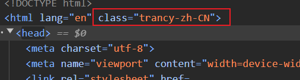

## 问题记录

### 1. 控制台报错

```
Warning: Extra attributes from the server: class at html at RootLayout (Server) at RedirectErrorBoundary
```

搜索了一些资料发现，这个问题的产生是由于插件，对没错，就是跟插件有关，有些插件会在这里注入一些内容，将插件禁用之后，就不会报错了。
这里有一个讨论这个问题的相关 [帖子](https://stackoverflow.com/questions/75337953/what-causes-nextjs-warning-extra-attributes-from-the-server-data-new-gr-c-s-c)


### 2. Mobx 与 React Context 配合使用

这里我新建了两个文件，一个 `index.tsx` 一个 `store.ts`，一个用来存放关于 store 所有的内容，一个是用来存放 `mobx` 与 `react context` 的内容，其实就是将 `mobx` 创建的‘对象’放到 `context` 当中去，这样其他组件就可以很容易来使用数据和修改数据了。

将状态管理库（ MobX）与 React Context 结合使用是一种非常流行和实用的方法。这种方法不仅帮助分离了业务逻辑和 UI 逻辑，还简化了组件间的状态传递，使得整个应用更加模块化和易维护。

### 3. mobx-react-lite 与 mobx-react 有什么区别

1. mobx-react-lite

`mobx-react-lite` 是 `MobX` 与 `React` 的轻量级集成库，旨在为需要性能和包大小的开发者提供高效的 `MobX` 支持，特别是针对仅使用 `React Hooks` 的现代 `React` 项目。

主要特点：

轻量级：没有类组件（class component）支持，这意味着它的包大小更小，只专注于函数组件（function component）。
基于 Hooks：完全依赖 `React Hooks`，如 `useState、useContext` 和 `observer` 高阶组件，使其适用于现代 `React` 代码库。
性能优化：减少了对旧有 `React` 特性的兼容，优化了性能，特别是在重绘、重渲染时的表现。

2. mobx-react

`mobx-react` 是 `MobX` 与 `React` 的全功能集成库，提供了对所有 `React` 特性的支持，包括类组件（class component）和函数组件（function component）。

主要特点：
全面功能：不仅支持函数组件，也支持类组件。这使得它对所有类型的 `React` 项目都适用，无论是老旧还是现代项目。
装饰器支持：支持 `ES6+` 的装饰器语法，使得类组件状态管理和反应更加简洁。
多功能性：拥有更丰富的 API，如 `Provider、inject、observer` 等，提供了更加多样化的状态管理方式。


### 4.关于 ‘跳转’ 的一些思考

首先，我不知道 ‘跳转’ 这种说法是不是合理，比如我点击了 `Menu` `组件里的‘Audio’模块的时候，Resource` 组件中会有对应页面的显示。

ok，以前我认为是 `Menu` 改变了这种行为，首先这种想法是没有问题的。但是我现在的想法有些变化了。

`Menu` 组件中的某种 ‘状态’ 改变了，比如是一个变量。

`Resource` 组件通过判断（监听）这个 ‘状态’ 的变化，做出相应的变化。

站在用户的角度去看我们开发的应用，看起来是很完整的，但是作为开发者，比如开发一个网页应用，所有的视图，都可以看成一个块一个块，也就是是一个组件，每个组件都是一个状态，每个状态都是一个变量。每个组件会根据这个变量的变化，做出相应的变化。

